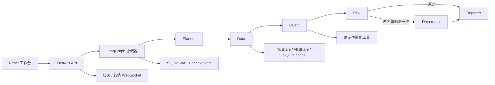

# QuantQuery-A：实时多 Agent 量化研究工作台

QuantQuery-A 是一个面向 AI Agent 工程与量化开发实习面试的本地研究工作台。它把自然语言研究任务转成一条可恢复、可评测、可审计的执行链：

`三路意图识别 → 实时取数 → 策略/因子研究 → 风险门禁 → 一次白名单修复 → 报告与监控`

项目由 FastAPI 托管 React 生产构建，使用 LangGraph 编排 Planner、Data、Quant、Risk、Reporter 五个 Qwen Agent。Agent 不自由聊天，只通过类型化 `ResearchState` 传递摘要、参数、证据 ID、指标、风险结论和 token 用量。

> 这是研究和工程演示系统，不接实盘下单，不宣称发现可交易 Alpha，不构成投资建议。

## 已实现

- 五 Agent LangGraph：确定性节点、SQLite 检查点、条件分支、失败恢复。
- 三路意图融合：`LLM 45% + TF-IDF 30% + 关键词 25%`，含置信度与边际澄清门槛。
- 单任务 15,000 token、最多 6 次模型调用；逐 Agent 记录 token、延迟、成功状态和错误类型，不记录完整提示词。
- Risk 确定性门禁拥有最终决定权；仅允许一次重新取数/规范参数/补字段修复。
- Tushare 前复权日线、AKShare 东方财富日线/分钟/快照适配器；60 秒自选池轮询与 WebSocket 推送。
- 最多 20 个标的、250 条日线、5 个交易日分钟数据；数据指纹、来源、复权、新鲜度和 stale 缓存标记。
- MACD、布林带、标的比较、价格成交量三因子组合。
- T 日收盘信号、下一交易日开盘成交，支持整手、佣金、最低佣金、税费和滑点。
- 因子 5%/95% 缩尾、Z-score、等权合成、周频 Top 5 只做多，以及 70/30 时间切分报告。
- React + TypeScript + TanStack Query + ECharts 四个页面：工作台、行情、实验室、监控。
- HTML、CSV、JSON 导出；任务取消、恢复、历史记录和实时 Agent 事件。
- 20 条冻结路由集、8 条端到端评测、候选路由权重生成与人工发布。

## 架构



详见 [架构说明](docs/ARCHITECTURE.md)、[产品需求](docs/WORKBENCH_PRD.md) 和 [课程来源与个人贡献](docs/ORIGIN.md)。

## 本地运行

Python 3.10+、Node.js 20+：

```powershell
python -m pip install -e ".[dev,api,market]"
Set-Location frontend
npm install
npm run build
Set-Location ..
$env:PYTHONPATH="src"
python -m uvicorn quantquery_a.api:app --host 127.0.0.1 --port 8000
```

打开 `http://127.0.0.1:8000/`。也可以运行：

```powershell
powershell -ExecutionPolicy Bypass -File scripts/start_workbench.ps1
```

默认 `QUANTQUERY_LLM_MODE=fake`，可离线演示。使用现有 DashScope 配置时：

```powershell
$env:QUANTQUERY_LLM_MODE="live"
$env:DASHSCOPE_API_KEY="<仅在本地环境注入>"
$env:QWEN_MODEL="qwen-plus"
$env:TUSHARE_TOKEN="<可选；Tushare 日线需要>"
```

密钥不写日志、不提交仓库。AKShare 不需要 token，但依赖东方财富网络可达；失败时系统返回 stale 缓存，没有缓存则阻断任务。

## 验证

```powershell
python -m ruff check src tests
python -m pytest -q
Set-Location frontend
npm run typecheck
npm test
npm run build
```

当前冻结 Mock 评测覆盖行情、MACD、布林带、因子、比较、数据源失败、风险阻断与一次自动修复。LLM Judge 只允许评相关性、清晰度和证据一致性，不能覆盖数值真值门禁。

## API

保留：`GET /healthz`、`POST /analyze`、`POST /eval/run`。

新增：

- `POST/GET /api/v1/runs`
- `GET /api/v1/runs/{run_id}`
- `POST /api/v1/runs/{run_id}/cancel|resume`
- `WS /api/v1/runs/{run_id}/events`
- `GET/POST /api/v1/watchlist`
- `GET /api/v1/market/{symbol}/daily|minute`
- `WS /api/v1/market/stream`
- `GET /api/v1/metrics/summary`
- `POST /api/v1/evals/run`
- `GET/POST /api/v1/router/weight-candidates`

## 数据与安全边界

- 本地单用户，只监听 localhost；开发 CORS 只允许本地 Vite 源站。
- 不做 RAG、Chroma、Redis、长期语义记忆、实盘交易或逐笔低延迟行情。
- Agent 不能执行生成的 SQL、Shell 或任意 Python，只能调用白名单工具。
- CI 只使用小型冻结行情和 Fake Qwen，不访问真实完整数据集。
- 真实数据冒烟测试最多 3 个标的。
