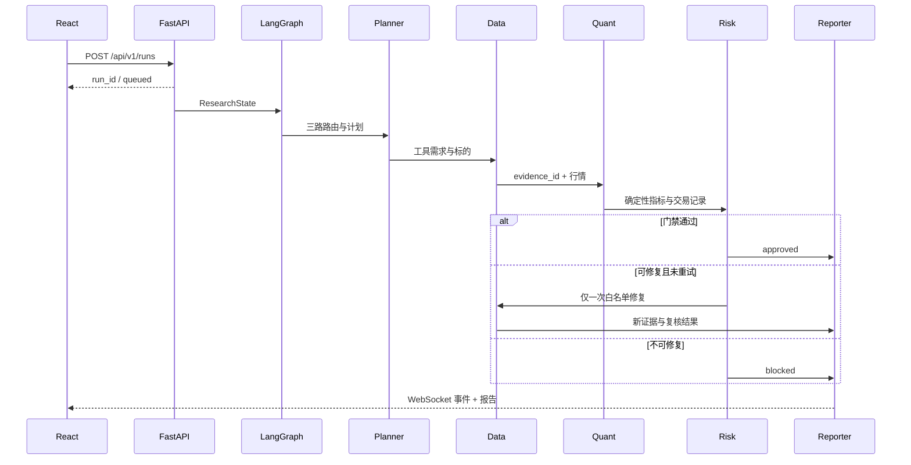

# QuantQuery-A 架构与运行边界

## 请求链

## 通信契约

Agent 不互发自由文本。`ResearchState` 只保存：

- 请求摘要、模式、标的和工具参数；
- 路由分数和计划；
- 证据 ID、数据指纹、来源、复权和新鲜度；
- 确定性工具指标与交易记录；
- 风险结论、修复次数、token 和调用次数；
- 报告与技术终态。

LLM 响应只能影响白名单内的计划和说明。数值计算、交易时点、成本、复权和风险门禁由代码决定。

## 持久化

单个 SQLite WAL 文件保存任务、Agent 事件、LLM 用量、watchlist、行情缓存、LangGraph checkpoint、评测结果和候选权重。研究任务最多并发 2 个，其余在进程内排队。

当前是本地单进程架构。多进程或多用户部署需要外部任务队列和集中式数据库，不在本项目承诺范围内。

## 数据失败语义

- 每次数据批次记录 provider、as_of、adjustment_status、freshness、fingerprint。
- 同一次回测不静默混用来源。
- 连续 3 次失败后提供方暂停 5 分钟。
- 有缓存返回 `stale=true`；无缓存阻断。
- 复权不明时，行情可展示，但跨期策略结论由 Risk 阻断。

## 评测口径

- 技术终态率：`completed/blocked/needs_clarification ÷ 已启动任务`。
- 评测任务成功率：实际状态和全部门禁符合预期的案例数 ÷ 案例数。
- 研究完成率：Risk 批准的研究任务数 ÷ 可执行研究任务数。
- 路由候选权重只能由固定集生成，并由用户手动发布；Risk 不参与降权。
